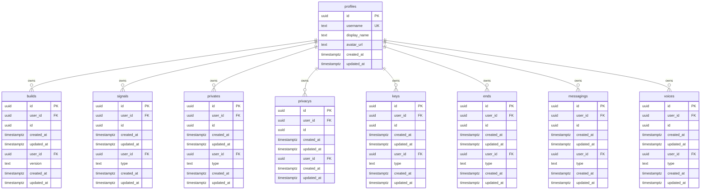

# Entity Relationship Diagram - Echo

> **Auto-generated** from your idea analysis
> **Entities:** 8

---

## Visual Diagram

---

## Entity Details

### Build
> Represents a build of the application

**Fields:**
  - `id`: uuid (required) - Primary key
  - `created_at`: datetime (required) - Creation timestamp
  - `updated_at`: datetime (required) - Last update timestamp
  - `user_id`: uuid (required) - Owner user ID
  - `version`: string (required) - Version number of the build

### Signal
> Represents a signal, such as a message or call

**Fields:**
  - `id`: uuid (required) - Primary key
  - `created_at`: datetime (required) - Creation timestamp
  - `updated_at`: datetime (required) - Last update timestamp
  - `user_id`: uuid (required) - Owner user ID
  - `type`: enum (required) - Type of signal

### Private
> Represents a private conversation or group

**Fields:**
  - `id`: uuid (required) - Primary key
  - `created_at`: datetime (required) - Creation timestamp
  - `updated_at`: datetime (required) - Last update timestamp
  - `user_id`: uuid (required) - Owner user ID
  - `type`: enum (required) - Type of private conversation or group

### Privacy
> Represents a user's privacy settings

**Fields:**
  - `id`: uuid (required) - Primary key
  - `created_at`: datetime (required) - Creation timestamp
  - `updated_at`: datetime (required) - Last update timestamp
  - `user_id`: uuid (required) - Owner user ID

### Key
> Represents a cryptographic key

**Fields:**
  - `id`: uuid (required) - Primary key
  - `created_at`: datetime (required) - Creation timestamp
  - `updated_at`: datetime (required) - Last update timestamp
  - `user_id`: uuid (required) - Owner user ID
  - `type`: enum (required) - Type of key

### End
> Represents the end of a conversation or call

**Fields:**
  - `id`: uuid (required) - Primary key
  - `created_at`: datetime (required) - Creation timestamp
  - `updated_at`: datetime (required) - Last update timestamp
  - `user_id`: uuid (required) - Owner user ID
  - `type`: enum (required) - Type of conversation or call

### Messaging
> Represents a messaging conversation

**Fields:**
  - `id`: uuid (required) - Primary key
  - `created_at`: datetime (required) - Creation timestamp
  - `updated_at`: datetime (required) - Last update timestamp
  - `user_id`: uuid (required) - Owner user ID
  - `type`: enum (required) - Type of messaging conversation

### Voice
> Represents a voice call

**Fields:**
  - `id`: uuid (required) - Primary key
  - `created_at`: datetime (required) - Creation timestamp
  - `updated_at`: datetime (required) - Last update timestamp
  - `user_id`: uuid (required) - Owner user ID
  - `type`: enum (required) - Type of voice call

---

## Notes

- All entities have standard fields: `id`, `user_id`, `created_at`, `updated_at`
- `PK` = Primary Key, `FK` = Foreign Key, `UK` = Unique Key
- Copy the Mermaid code block to visualize in any Mermaid-compatible tool
- Relationships: `||--o{` = one-to-many, `||--||` = one-to-one, `}o--o{` = many-to-many
